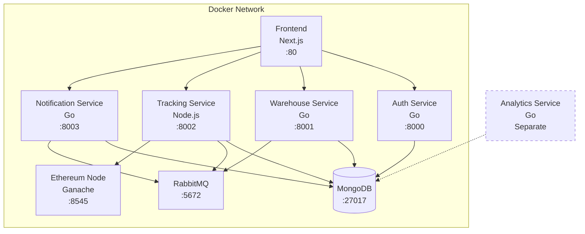

# Warehouse Management and Equipment Tracking System - Architecture Documentation

## General System Architecture

The system is built on a microservices architecture, where each service performs a specific function and exchanges data with other services via REST API and RabbitMQ messages. Data is stored in MongoDB, and Ethereum blockchain (Ganache for MVP) is used for equipment transfer tracking.

## Project Structure

The project is organized in the `mvp/` directory and contains the following components:

- **auth-service/** - Authentication Service (Go)
- **warehouse-service/** - Warehouse Management Service (Go)
- **tracking-service-express/** - Equipment Tracking Service (Node.js/Express)
- **notification-service/** - Notification Service (Go)
- **analytics-service/** - Analytics Service (Go, minimal implementation, not included in Docker Compose)
- **frontend/** - Web Interface (Next.js with Mantine UI)
- **docker-compose.yml** - Containerization configuration
- Documentation and deployment scripts

## Architecture Diagram

### System Components Diagram

### Main Components

1. **Auth Service (Go)**: Authentication and authorization, user Ethereum address management.
2. **Warehouse Service (Go)**: Warehouse and equipment management, including invoice system.
3. **Tracking Service (Node.js/Express)**: Equipment tracking with blockchain integration, including smart contract deployment and interaction.
4. **Notification Service (Go)**: Notification sending and management.
5. **Analytics Service (Go)**: Minimal implementation (only prints welcome message) - not included in Docker Compose for MVP.
6. **Frontend (Next.js)**: System user interface with Mantine UI components.
7. **MongoDB**: Data storage for all services.
8. **RabbitMQ**: Message exchange between services.
9. **Ethereum Node (Ganache)**: Local blockchain for equipment transfer tracking.

### MongoDB Databases

Each service uses a separate database in MongoDB:

- **warehouse_auth** - Auth Service database (users, sessions, audit, settings)
- **warehouse_inventory** - Warehouse Service database (items, transactions, invoices, references)
- **warehouse_tracking** - Tracking Service database (tracking, transfers, maintenance)

**Total collections in system: 12 (FULLY IMPLEMENTED)**

**Collections distribution:**

- **warehouse_auth: 3 collections** (users, audit_logs, system_settings) - ✅ **IMPLEMENTED**
- **warehouse_inventory: 6 collections** (warehouseitems, inventorytransactions, invoices, categories, warehouses, suppliers) - ✅ **IMPLEMENTED**
- **warehouse_tracking: 3 collections** (equipments, transfers, maintenance_schedules) - ✅ **IMPLEMENTED**

**Implementation Status:**

✅ **Auth Service (Go)**: All 3 collections with full CRUD API endpoints
✅ **Warehouse Service (Go)**: All 6 collections with full CRUD API endpoints
✅ **Tracking Service (Node.js/Express)**: All 3 collections with full CRUD API endpoints
✅ **Demo Data**: Automatic creation of test data for all collections

**Note**: Notification Service in current MVP implementation stores data in memory. Database **warehouse_notifications** is configured in docker-compose.yml for future development.

### Detailed MongoDB Collection Information

#### Database: warehouse_auth (Auth Service)

**Collection: users**

- **Purpose**: Storing system user information
- **Indexes**:
  - `username` (unique)
  - `email` (unique)
  - `eth_address`
  - `role`
  - `is_active`
- **Approximate document size**: 500-800 bytes
- **Features**:
  - Stores hashed passwords
  - Automatically generates Ethereum address on creation
  - Tracks last login time

#### Database: warehouse_inventory (Warehouse Service)

**Collection: warehouseitems**

- **Purpose**: Warehouse equipment catalog
- **Indexes**:
  - `serial_number` (unique)
  - `category`
  - `status`
  - `location`
  - `warranty_expiry`
- **Features**:
  - Warranty tracking
  - Minimum stock alerts
  - Inventory history

**Collection: inventorytransactions**

- **Purpose**: Equipment operation history (intake/issue)
- **Indexes**:
  - `item_id`
  - `transaction_type`
  - `date` (descending)
  - `responsible_user`
- **Features**:
  - Linked to specific equipment items
  - Tracks responsible persons
  - Reasons and notes for operations

**Collection: invoices**

- **Purpose**: Incoming and outgoing invoices
- **Indexes**:
  - `number` (unique)
  - `type`
  - `date` (descending)
  - `transaction_id`
- **Features**:
  - Linked to transactions
  - Itemized details
  - Recipient and issuer information

#### Database: warehouse_tracking (Tracking Service)

**Collection: equipments**

- **Purpose**: Equipment location tracking
- **Indexes**:
  - `serialNumber` (unique)
  - `currentHolderId`
  - `blockchainId`
  - `status`
- **Features**:
  - Blockchain integration
  - Current equipment holder
  - Lifecycle statuses

**Collection: transfers**

- **Purpose**: Equipment transfer history between holders
- **Indexes**:
  - `equipmentId`
  - `fromHolderId`
  - `toHolderId`
  - `transferDate` (descending)
  - `blockchainTxId`
- **Features**:
  - Linked to blockchain transactions
  - Transfer reasons
  - Chain of custody

### API Endpoints

(See full API Reference in `API_REFERENCE.md`)

## Blockchain Functions (Ethereum)

### EquipmentTracking (Smart Contract)

| Function                                 | Description                                |
| ---------------------------------------- | ------------------------------------------ |
| `registerEquipment(name, serialNumber)`  | Register new equipment on blockchain       |
| `issueEquipment(id, to)`                 | Issue equipment from warehouse to employee |
| `transferEquipment(id, from, to, notes)` | Transfer equipment between employees       |
| `returnEquipment(id, from)`              | Return equipment to warehouse              |
| `getCurrentHolder(id)`                   | Get current equipment holder               |
| `getTransferCount(id)`                   | Get number of equipment transfers          |

## Component Interaction

### Invoice Creation Process:

1. User creates a transaction via Warehouse Service (intake or issue).
2. Warehouse Service saves transaction to MongoDB.
3. User creates an invoice based on existing transactions.
4. Warehouse Service generates unique invoice number and saves to MongoDB.
5. Invoice includes recipient/issuer data, items, and total cost.
6. Invoice is linked to transaction via TransactionID.

### Equipment Registration Process:

1. User creates new equipment via Warehouse Service.
2. Warehouse Service saves info to MongoDB.
3. Warehouse Service sends message to RabbitMQ ("warehouse_exchange", key: "equipment.created").
4. Tracking Service receives message from "equipment_created_queue" and auto-creates equipment record.
5. Tracking Service calls register method in smart contract.
6. Ethereum Node processes transaction and returns blockchain ID.
7. Tracking Service updates equipment record with blockchainId.

### Equipment Transfer Process:

1. User initiates transfer via Tracking Service.
2. Tracking Service requests Ethereum addresses via Auth Service.
3. Tracking Service creates transfer record in MongoDB.
4. Tracking Service calls `transferEquipment` or `issueEquipment` in smart contract.
5. Ethereum Node processes transaction.
6. Tracking Service updates transfer record with `blockchainTxId`.
7. Tracking Service sends message to RabbitMQ ("tracking_exchange", key: "equipment.transferred").
8. Notification Service receives message and creates notifications for participants.

## Deployment Configuration

The system is deployed using Docker and Docker Compose. Each service has its own Dockerfile, and the overall configuration is described in `docker-compose.yml`.

## Security and Authorization

The system uses JWT (JSON Web Tokens) for user authentication and authorization. The token is obtained upon login and must be included in the Authorization header for protected resources.

## Asynchronous Interaction via RabbitMQ

The system uses RabbitMQ for asynchronous message exchange between microservices. This ensures loose coupling and reliable event delivery.

## Blockchain Integration

The system is integrated with a local Ethereum blockchain (Ganache for MVP) to ensure transparency and immutability of equipment transfer history.

## Frontend Technologies

Frontend is built on:

- **Next.js 15** with App Router
- **Mantine UI**
- **Redux Toolkit** and **React Redux**
- **TanStack React Query**
- **React Hook Form** with **Zod**
- **Axios**
- **Tailwind CSS**
- **ApexCharts**
- **TypeScript**

## MVP Limitations

### Analytics Service

- Minimal functionality.
- Not included in docker-compose.yml.

### Notification Service

- Uses in-memory storage instead of MongoDB.
- Data is lost on restart.

### General MVP Limitations

- No persistence of blockchain data between Ganache restarts.
- No database migration mechanism.
- Simplified role system.
- Lack of comprehensive logging and monitoring.

## Deployment Instructions

### System Requirements

- **Docker** (version 20.10+)
- **Docker Compose** (version 2.0+)
- **Git**

### Steps

1. Clone repository.
2. Build and start system: `docker-compose up -d`.
3. Check status: `docker-compose ps`.
4. Initial setup: Auth Service creates admin user automatically (`admin` / `admin123`).

## Performance and Optimization

- Recommended MongoDB indexing.
- RabbitMQ optimization.
- Service scaling capabilities.
- Caching recommendations.

## Recommendations for Developers

1. Use unified API documentation (Swagger/OpenAPI).
2. Follow RESTful API principles.
3. Implement detailed user action logging.
4. Use MongoDB indexes.
5. Add caching for frequently accessed data.
6. Configure system monitoring.
7. Implement CI/CD.
