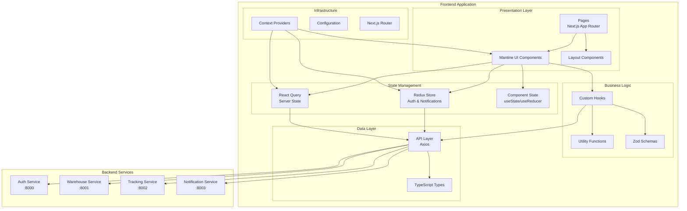
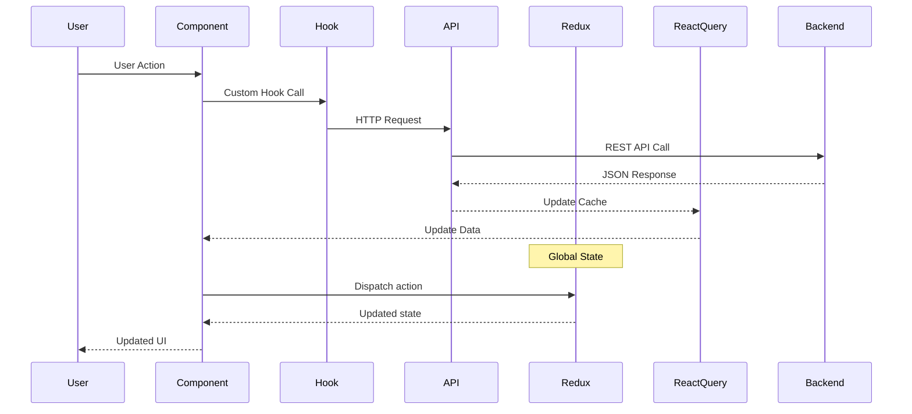

# Warehouse Management and Equipment Tracking System - Frontend Architecture Documentation

## General Frontend Architecture

The frontend application is built on a modern React architecture using Next.js 15 and App Router. The application implements a client-server architecture where the frontend interacts with microservice backend via REST API. Redux Toolkit is used for state management, React Query for server state management, and the user interface is built with Mantine UI components.

## Project Structure

The project is organized in the `frontend/` directory and contains the following components:

```
frontend/
├── src/
│   ├── app/                 # App Router pages (Next.js 15)
│   │   ├── dashboard/       # Dashboard and analytics
│   │   ├── invoices/        # Invoice management
│   │   ├── login/           # Authentication
│   │   ├── reports/         # Reports and analytics
│   │   ├── tracking/        # Equipment tracking
│   │   ├── users/           # User management
│   │   ├── warehouse/       # Warehouse management
│   │   ├── layout.tsx       # Root layout
│   │   └── page.tsx         # Main page
│   ├── components/          # React components
│   │   ├── common/          # Reusable components
│   │   ├── layout/          # Layout components
│   │   └── providers/       # Provider components
│   ├── api/                 # API layer
│   │   ├── auth.ts          # Authentication API
│   │   ├── invoices.ts      # Invoice API
│   │   ├── notification.ts  # Notification API
│   │   ├── reports.ts       # Reports API
│   │   ├── tracking.ts      # Tracking API
│   │   └── warehouse.ts     # Warehouse API
│   ├── store/               # Redux store
│   │   ├── authSlice.ts     # Auth state
│   │   ├── notificationsSlice.ts # Notification state
│   │   └── index.ts         # Store configuration
│   ├── hooks/               # Custom React hooks
│   ├── types/               # TypeScript types
│   │   ├── documents.ts     # Document types
│   │   ├── invoices.ts      # Invoice types
│   │   ├── notification.ts  # Notification types
│   │   ├── reports.ts       # Report types
│   │   ├── tracking.ts      # Tracking types
│   │   ├── user.ts          # User types
│   │   └── warehouse.ts     # Warehouse types
│   └── utils/               # Utilities
├── public/                  # Static files
├── package.json             # Project dependencies
├── next.config.ts           # Next.js configuration
├── tailwind.config.js       # Tailwind CSS configuration
├── tsconfig.json            # TypeScript configuration
└── Dockerfile               # Docker configuration
```

## Technology Stack

### Core Technologies

- **Next.js 15** - React framework with App Router
- **React 19** - Main UI library
- **TypeScript 5** - Static typing
- **Mantine 8** - UI component library
- **Tailwind CSS 4** - Utility-first CSS framework

### State Management

- **Redux Toolkit 2.8** - Global state management
- **React Redux 9.2** - Redux integration with React
- **React Query 5.76** - Server state management and caching

### Forms and Validation

- **React Hook Form 7.56** - Form management
- **Zod 3.24** - Schema validation
- **@hookform/resolvers 5.0** - Zod integration with React Hook Form

### HTTP Client and API

- **Axios 1.9** - HTTP client for API requests

### UI and UX

- **@tabler/icons-react 3.33** - Icons
- **@mantine/notifications 8.0** - Notification system
- **@mantine/dates 8.0** - Date components
- **date-fns 4.1** - Date utilities

### Visualization and Reports

- **ApexCharts 4.7** - Charting library
- **react-apexcharts 1.7** - React wrapper for ApexCharts
- **jsPDF 3.0** - PDF generation
- **@react-pdf/renderer 4.3** - React components for PDF
- **react-to-print 3.1** - Component printing

## Frontend Architecture Schema

### Architecture Diagram



### Data Flow



## Detailed Component Architecture

### 1. App Router (Next.js 15)

The application uses the new App Router architecture from Next.js 15:

**Main Routes:**

- `/` - Main page (redirect to dashboard)
- `/login` - Authentication page
- `/dashboard` - Dashboard and general analytics
- `/warehouse` - Warehouse and inventory management
- `/tracking` - Equipment and transfer tracking
- `/invoices` - Invoice management
- `/users` - User management (admin)
- `/reports` - Reports and analytics

**Implementation Features:**

- Server Components for performance optimization
- Client Components for interactivity
- Automatic code splitting
- Optimized resource loading

### 2. Detailed Page Architecture

#### 2.1. Main Page (/)

**Purpose:** Entry point to the application with automatic redirection to the dashboard for authenticated users.

**Functionality:**

- Check authentication status
- Redirect to `/dashboard` for authorized users
- Redirect to `/login` for unauthorized users
- Display loading state

**Components:**

- `AuthGuard` - Route protection
- `LoadingSpinner` - Loading indicator
- `RedirectHandler` - Redirection logic

#### 2.2. Authentication Page (/login)

**Purpose:** User login to the system with support for different roles.

**Functionality:**

- Login form with validation
- Authentication via Auth Service
- Remember Me functionality
- Login error handling
- Redirect after successful login

**API Integration:**

- `POST /login` - User authentication
- `POST /refresh` - Token refresh

**Components:**

- `LoginForm` - Login form with validation
- `RememberMeCheckbox` - Remember user checkbox
- `ErrorMessage` - Error display
- `SocialLoginButtons` - Social login (if implemented)

**UX Features:**

- Autofocus on email field
- Show/hide password
- Real-time validation
- Responsive design for mobile devices

#### 2.3. Dashboard (/dashboard)

**Purpose:** Central page with an overview of key metrics and quick access to main functions.

**Functionality:**

- Overview of key warehouse metrics
- System status charts and diagrams
- Recent activities and notifications
- Quick actions (add item, create invoice)
- Real-time equipment status

**API Integration:**

- `GET /dashboard/metrics` - Main metrics
- `GET /dashboard/activities` - Recent activities
- `GET /notifications` - Notifications
- `GET /equipment/status` - Equipment status

**Components:**

- `MetricsCards` - Cards with key indicators
- `ActivityTimeline` - Activity feed
- `EquipmentStatusWidget` - Equipment status widget
- `QuickActionsPanel` - Quick actions panel
- `ChartsSection` - Charts and diagrams section

**Access Rights:**

- All authenticated users
- Data is filtered by user role

#### 2.4. Warehouse Management (/warehouse)

**Purpose:** Complete management of warehouse operations, inventory, and goods movement.

**Functionality:**

- View and search warehouse items
- Add, edit, and delete items
- Manage item categories
- Inventory and write-off
- Move items between warehouses
- Track stock levels and critical levels

**API Integration:**

- `GET /items` - Item list with pagination and filtering
- `POST /items` - Add new item
- `PUT /items/:id` - Update item
- `DELETE /items/:id` - Delete item
- `GET /categories` - Item categories
- `GET /warehouses` - Warehouse list
- `GET /transactions` - Operation history

**Components:**

- `WarehouseItemsTable` - Item table with filtering
- `AddItemModal` - Add item modal
- `EditItemModal` - Edit item modal
- `CategoriesManager` - Category management
- `InventoryStatus` - Inventory status
- `LowStockAlerts` - Low stock alerts

**Access Rights:**

- Warehouse Manager: full access
- Warehouse Operator: view and basic operations
- Admin: full access to all warehouses

#### 2.5. Equipment Tracking (/tracking)

**Purpose:** Monitor and manage equipment with blockchain technology support.

**Functionality:**

- Registry of all equipment
- Track location and status
- Equipment transfer history
- Maintenance planning and tracking
- Blockchain integration for transparency
- QR codes for quick identification

**API Integration:**

- `GET /equipment` - Equipment list
- `POST /equipment` - Add equipment
- `GET /transfers` - Transfer history
- `POST /transfers` - Create transfer
- `GET /maintenance` - Maintenance schedule
- `POST /blockchain/deploy` - Blockchain operations

**Components:**

- `EquipmentRegistry` - Equipment registry
- `TransferHistory` - Transfer history
- `MaintenanceScheduler` - Maintenance scheduler
- `QRCodeGenerator` - QR code generator
- `BlockchainStatus` - Blockchain transaction status
- `EquipmentMap` - Equipment location map

**Access Rights:**

- Equipment Manager: full management access
- Technician: maintenance and status access
- Viewer: view only

#### 2.6. Invoice Management (/invoices)

**Purpose:** Create, process, and manage invoices and document flow.

**Functionality:**

- Create incoming and outgoing invoices
- Print and export documents
- Approve and sign invoices
- Document operation history
- Integration with warehouse operations
- Generate document reports

**API Integration:**

- `GET /invoices` - Invoice list
- `POST /invoices` - Create invoice
- `PUT /invoices/:id` - Update invoice
- `DELETE /invoices/:id` - Delete invoice
- `POST /invoices/:id/approve` - Approve invoice
- `GET /invoices/:id/pdf` - Generate PDF

**Components:**

- `InvoicesList` - Invoice list with filtering
- `CreateInvoiceForm` - Create invoice form
- `InvoicePreview` - Preview
- `ApprovalWorkflow` - Approval workflow
- `PDFGenerator` - PDF generator
- `DigitalSignature` - Digital signature

**Access Rights:**

- Accountant: create and edit invoices
- Manager: approve invoices
- Viewer: view approved documents only

#### 2.7. User Management (/users)

**Purpose:** Administration of system users and access rights management.

**Functionality:**

- View list of all users
- Create new accounts
- Edit user profiles
- Manage roles and permissions
- Block/unblock users
- User activity audit

**API Integration:**

- `GET /users` - User list
- `POST /users` - Create user
- `PUT /users/:id` - Update user
- `DELETE /users/:id` - Delete user
- `POST /users/:id/block` - Block user
- `GET /users/:id/activity` - User activity

**Components:**

- `UsersTable` - User table
- `CreateUserModal` - Create user modal
- `EditUserModal` - Edit user modal
- `RoleManager` - Role management
- `UserActivityLog` - Activity log
- `PermissionsMatrix` - Permissions matrix

**Access Rights:**

- Admin: full access to all functions
- HR Manager: user management (limited)
- Other roles: access denied

#### 2.8. Reports and Analytics (/reports)

**Purpose:** Generate analytical reports and visualize data for decision making.

**Functionality:**

- Warehouse reports (stock, turnover, ABC analysis)
- Equipment reports (usage, maintenance)
- Financial reports on invoices
- Custom reports with configurable parameters
- Export reports in various formats
- Automatic report scheduling

**API Integration:**

- `GET /reports/warehouse` - Warehouse reports
- `GET /reports/equipment` - Equipment reports
- `GET /reports/financial` - Financial reports
- `POST /reports/custom` - Custom reports
- `GET /reports/:id/export` - Export report

**Components:**

- `ReportsFilter` - Report filters
- `ReportChart` - Charts and diagrams
- `ReportTable` - Tabular reports
- `ExportOptions` - Export options
- `ReportScheduler` - Report scheduler
- `CustomReportBuilder` - Report builder

**Access Rights:**

- Manager: access to all reports
- Analyst: access to analytical reports
- Department Head: reports for their department

#### 2.9. General Page Architecture Features

**Layout Structure:**

```typescript
// General layout structure for all pages
<AppShell>
  <AppShell.Header>
    <Header />
  </AppShell.Header>

  <AppShell.Navbar>
    <Navigation />
  </AppShell.Navbar>

  <AppShell.Main>{children}</AppShell.Main>

  <NotificationsProvider />
</AppShell>
```

**Common Components:**

- `PageHeader` - Page header with breadcrumbs
- `LoadingOverlay` - Loading overlay
- `ErrorBoundary` - Error handling
- `PermissionGuard` - Access rights check
- `PageActions` - Page actions panel

**Usage Patterns:**

- All pages use React Query for data caching
- Consistent error handling via Error Boundaries
- Consistent navigation and breadcrumbs
- Responsive design for all device types
- Keyboard navigation support

### 3. Provider Architecture

Provider architecture ensures dependency injection:

```typescript
// Provider hierarchy
<MantineProvider>
  <ReduxProvider>
    <QueryProvider>
      <AuthProvider>
        <Notifications />
        {children}
      </AuthProvider>
    </QueryProvider>
  </ReduxProvider>
</MantineProvider>
```

**Providers:**

- **MantineProvider** - UI library context and theming
- **ReduxProvider** - Global application state
- **QueryProvider** - Server state management and caching
- **AuthProvider** - Authentication and authorization context

### 3. State Management Architecture

#### Redux Store

Global state is divided into slices:

```typescript
// Store structure
{
  auth: {
    user: User | null,
    token: string | null,
    isAuthenticated: boolean,
    loading: boolean
  },
  notifications: {
    items: Notification[],
    unreadCount: number
  }
}
```

**Slices:**

- **authSlice** - User authentication state
- **notificationsSlice** - Notification management

#### React Query

Server state management and caching:

- **Caching** - Automatic API response caching
- **Invalidation** - Smart invalidation of stale data
- **Optimistic Updates** - Instant UI feedback
- **Retry Logic** - Automatic retries for failed requests
- **Pagination** - Pagination and infinite scroll support

### 4. API Layer Architecture

#### API Layer Structure

API layer is organized by domain:

```typescript
// API modules
src/api/
├── auth.ts          # Authentication and authorization
├── warehouse.ts     # Warehouse management
├── tracking.ts      # Equipment tracking
├── invoices.ts      # Invoices
├── notification.ts  # Notifications
└── reports.ts       # Reports and analytics
```

#### HTTP Client Configuration

Centralized Axios configuration:

```typescript
// Base configuration
const api = {
  auth: axios.create({ baseURL: "http://localhost:8000" }),
  warehouse: axios.create({ baseURL: "http://localhost:8001" }),
  tracking: axios.create({ baseURL: "http://localhost:8002" }),
  notification: axios.create({ baseURL: "http://localhost:8003" }),
};
```

**Features:**

- Automatic authorization token injection
- Error interception and automatic token refresh
- Retry logic for failed requests
- Request logging in development mode

### 5. Component Architecture

#### Component Organization

```
src/components/
├── common/          # Reusable components
│   ├── buttons/
│   ├── forms/
│   ├── modals/
│   └── tables/
├── layout/          # Layout components
│   ├── AppShell/
│   ├── Header/
│   ├── Navigation/
│   └── Sidebar/
└── providers/       # Provider components
    ├── auth-provider.tsx
    ├── mantine-provider.tsx
    ├── query-provider.tsx
    └── redux-provider.tsx
```

#### Component Design Patterns

**1. Container/Presentational Pattern:**

- Containers manage state and business logic
- Presentational components are responsible only for rendering

**2. Compound Components:**

- Used for complex UI elements
- Provides flexibility and reusability

**3. Render Props & Custom Hooks:**

- Logic is extracted into custom hooks
- Components focus on rendering

### 6. TypeScript Types Architecture

#### Type Organization

```typescript
src/types/
├── user.ts          # User and authentication types
├── warehouse.ts     # Warehouse accounting types
├── tracking.ts      # Equipment tracking types
├── invoices.ts      # Invoice types
├── reports.ts       # Report types
├── notification.ts  # Notification types
└── documents.ts     # Document and file types
```

#### Type Safety Strategy

- **Strict Typing** - All API responses are typed
- **Shared Types** - Types are shared between components
- **Runtime Validation** - Zod schemas for runtime validation
- **Generic Components** - Reusable typed components

## Backend Service Integration

### 1. Auth Service Integration

**Endpoints:**

- `POST /login` - User authentication
- `POST /signup` - New user registration
- `POST /refresh` - Access token refresh
- `GET /profile` - Get user profile
- `GET /users` - User list (admin)
- `PUT /users/:id` - Update user

**Features:**

- JWT tokens with auto-refresh
- Role-based authorization
- Protected routes

### 2. Warehouse Service Integration

**Endpoints:**

- `GET /items` - Warehouse item list
- `POST /items` - Add new item
- `PUT /items/:id` - Update item
- `DELETE /items/:id` - Delete item
- `GET /transactions` - Transaction history
- `GET /categories` - Item categories
- `GET /warehouses` - Warehouse list

**Features:**

- Pagination and filtering
- Batch operations
- Real-time updates via polling

### 3. Tracking Service Integration

**Endpoints:**

- `GET /equipment` - Equipment list
- `POST /equipment` - Add equipment
- `GET /transfers` - Transfer history
- `POST /transfers` - Create transfer
- `GET /maintenance` - Maintenance schedule
- `POST /blockchain/deploy` - Contract deployment

**Features:**

- Blockchain integration
- Real-time equipment statuses
- Geolocation and tracking

### 4. Notification Service Integration

**Endpoints:**

- `GET /notifications` - Notification list
- `POST /notifications` - Create notification
- `PUT /notifications/:id/read` - Mark as read
- `DELETE /notifications/:id` - Delete notification

**Features:**

- Real-time notifications
- Push notifications
- Email notifications

## UI/UX Architecture

### 1. Design System (Mantine UI)

**Components:**

- **Layout** - AppShell, Grid, Container
- **Navigation** - Navbar, Breadcrumbs, Pagination
- **Data Display** - Table, Card, Badge, Timeline
- **Inputs** - TextInput, Select, DatePicker, FileInput
- **Feedback** - Notifications, Modals, Loading
- **Charts** - ApexCharts integration

**Theming:**

- Custom color palette
- Responsive design
- Dark/Light modes
- Typography and spacing

### 2. Responsive Design

**Breakpoints:**

- **xs** - 576px (mobile)
- **sm** - 768px (tablet)
- **md** - 992px (desktop)
- **lg** - 1200px (large screens)
- **xl** - 1400px (extra large screens)

**Strategy:**

- Mobile-first approach
- Flexible Grid systems
- Responsive navigation
- Optimization for touch devices

### 3. Accessibility (a11y)

**Implemented Features:**

- ARIA labels and roles
- Keyboard navigation
- Screen reader support
- Contrast compliance
- Focus management

## Performance Optimization

### 1. Code Splitting

- **Automatic splitting** - Next.js automatically splits code by pages
- **Dynamic imports** - Lazy loading for heavy components
- **Bundle analysis** - Monitoring bundle sizes

### 2. Caching Strategy

- **React Query cache** - Intelligent API response caching
- **Browser cache** - Static assets caching
- **CDN integration** - Readiness for CDN deployment

### 3. Image Optimization

- **Next.js Image component** - Automatic image optimization
- **WebP format** - Modern image formats
- **Lazy loading** - Deferred image loading

## Error Handling

### 1. Error Boundaries

- **Global error boundary** - Intercept critical errors
- **Component error boundaries** - Local error handling
- **Fallback UI** - User-friendly error pages

### 2. API Error Handling

- **HTTP status codes** - Correct status handling
- **Retry logic** - Automatic retries
- **User feedback** - Informative error messages

### 3. Form Validation

- **Zod schemas** - Strict data validation
- **Real-time validation** - Input validation
- **Error messages** - Clear error messages

## Security Measures

### 1. Authentication Security

- **JWT tokens** - Secure access tokens
- **Token refresh** - Automatic token renewal
- **Secure storage** - Secure token storage

### 2. Input Validation

- **Client-side validation** - Initial validation
- **Server-side validation** - Final validation on server
- **XSS protection** - Protection against cross-site scripting

### 3. Route Protection

- **Private routes** - Protected routes
- **Role-based access** - Access control by roles
- **Redirect logic** - Correct redirections

## Testing Strategy

### 1. Unit Testing

- **Jest** - Unit testing framework
- **React Testing Library** - Testing React components
- **MSW** - Mock Service Worker for API testing

### 2. Integration Testing

- **API integration tests** - Testing API integration
- **User flow tests** - Testing user scenarios

### 3. E2E Testing

- **Playwright/Cypress** - End-to-end testing
- **Critical path testing** - Testing critical paths

## Development Workflow

### 1. Development Server

```bash
# Start development server
npm run dev

# Build for production
npm run build

# Start production server
npm start

# Lint code
npm run lint
```

### 2. Environment Configuration

```typescript
// Environment variables
NEXT_PUBLIC_API_AUTH_URL=http://localhost:8000
NEXT_PUBLIC_API_WAREHOUSE_URL=http://localhost:8001
NEXT_PUBLIC_API_TRACKING_URL=http://localhost:8002
NEXT_PUBLIC_API_NOTIFICATION_URL=http://localhost:8003
```

### 3. Docker Development

```dockerfile
# Multi-stage build for optimization
FROM node:18-alpine AS deps
FROM node:18-alpine AS builder
FROM node:18-alpine AS runner
```

## Deployment Architecture

### 1. Production Build

- **Static optimization** - Static page optimization
- **Asset optimization** - Minification and compression of resources
- **Bundle splitting** - Optimal bundle splitting

### 2. Docker Deployment

- **Multi-stage builds** - Optimized Docker images
- **Environment configuration** - Flexible environment configuration
- **Health checks** - Application health checks

### 3. Production Considerations

- **Monitoring** - Performance monitoring
- **Logging** - Structured logging
- **Analytics** - Usage analytics

## Conclusion

The frontend architecture is built using modern practices and technologies ensuring:

- **Scalability** - Modular architecture allows easy addition of new features
- **Performance** - Optimization of loading and rendering ensures fast response
- **Reliability** - Strict typing and testing minimize errors
- **Development Convenience** - Clear structure and tools speed up development
- **Security** - Secure authentication and data validation
- **Accessibility** - Compliance with accessibility standards
- **Modernity** - Using current technologies and approaches

The architecture is ready for further development and expansion of functionality of the warehouse management and equipment tracking system.
