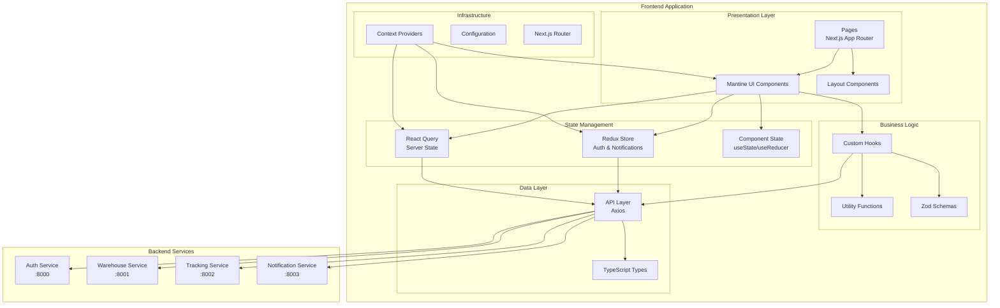
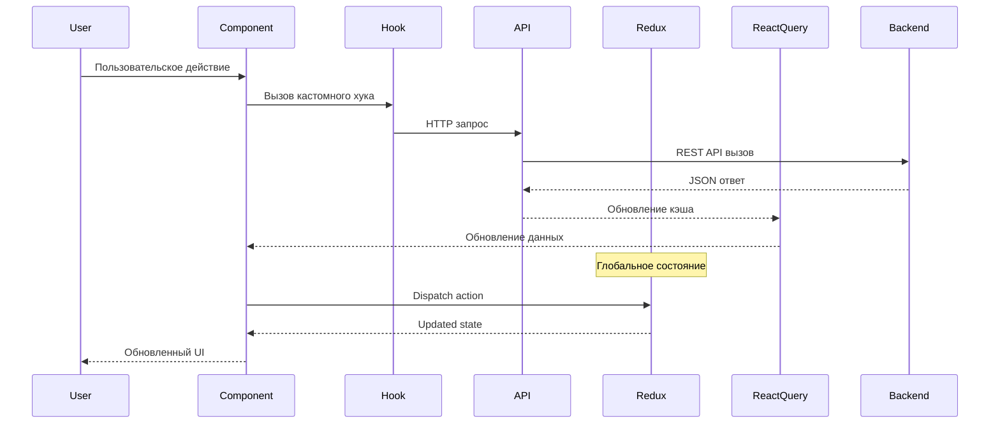

# Система управления складом и отслеживания оборудования - Документация архитектуры Frontend

## Общая архитектура Frontend

Frontend приложение построено на основе современной архитектуры React с использованием Next.js 15 и App Router. Приложение реализует клиент-серверную архитектуру, где frontend взаимодействует с микросервисным backend через REST API. Для управления состоянием используется Redux Toolkit, для работы с сервером - React Query, а пользовательский интерфейс построен на компонентах Mantine UI.

## Структура проекта

Проект организован в директории `frontend/` и содержит следующие компоненты:

```
frontend/
├── src/
│   ├── app/                 # App Router страницы (Next.js 15)
│   │   ├── dashboard/       # Дашборд и аналитика
│   │   ├── invoices/        # Управление накладными
│   │   ├── login/           # Аутентификация
│   │   ├── reports/         # Отчеты и аналитика
│   │   ├── tracking/        # Отслеживание оборудования
│   │   ├── users/           # Управление пользователями
│   │   ├── warehouse/       # Управление складом
│   │   ├── layout.tsx       # Корневой layout
│   │   └── page.tsx         # Главная страница
│   ├── components/          # React компоненты
│   │   ├── common/          # Переиспользуемые компоненты
│   │   ├── layout/          # Компоненты layout
│   │   └── providers/       # Provider компоненты
│   ├── api/                 # API слой
│   │   ├── auth.ts          # API для аутентификации
│   │   ├── invoices.ts      # API для накладных
│   │   ├── notification.ts  # API для уведомлений
│   │   ├── reports.ts       # API для отчетов
│   │   ├── tracking.ts      # API для отслеживания
│   │   └── warehouse.ts     # API для склада
│   ├── store/               # Redux store
│   │   ├── authSlice.ts     # Состояние аутентификации
│   │   ├── notificationsSlice.ts # Состояние уведомлений
│   │   └── index.ts         # Конфигурация store
│   ├── hooks/               # Кастомные React hooks
│   ├── types/               # TypeScript типы
│   │   ├── documents.ts     # Типы документов
│   │   ├── invoices.ts      # Типы накладных
│   │   ├── notification.ts  # Типы уведомлений
│   │   ├── reports.ts       # Типы отчетов
│   │   ├── tracking.ts      # Типы отслеживания
│   │   ├── user.ts          # Типы пользователей
│   │   └── warehouse.ts     # Типы склада
│   └── utils/               # Утилиты
├── public/                  # Статические файлы
├── package.json             # Зависимости проекта
├── next.config.ts           # Конфигурация Next.js
├── tailwind.config.js       # Конфигурация Tailwind CSS
├── tsconfig.json            # Конфигурация TypeScript
└── Dockerfile               # Docker конфигурация
```

## Технологический стек

### Основные технологии

- **Next.js 15** - React фреймворк с App Router
- **React 19** - Основная библиотека для UI
- **TypeScript 5** - Статическая типизация
- **Mantine 8** - UI библиотека компонентов
- **Tailwind CSS 4** - Utility-first CSS фреймворк

### Управление состоянием

- **Redux Toolkit 2.8** - Управление глобальным состоянием
- **React Redux 9.2** - Интеграция Redux с React
- **React Query 5.76** - Управление серверным состоянием и кэшированием

### Работа с формами и валидация

- **React Hook Form 7.56** - Управление формами
- **Zod 3.24** - Валидация схем
- **@hookform/resolvers 5.0** - Интеграция Zod с React Hook Form

### HTTP клиент и API

- **Axios 1.9** - HTTP клиент для API запросов

### UI и UX

- **@tabler/icons-react 3.33** - Иконки
- **@mantine/notifications 8.0** - Система уведомлений
- **@mantine/dates 8.0** - Компоненты для работы с датами
- **date-fns 4.1** - Утилиты для работы с датами

### Визуализация и отчеты

- **ApexCharts 4.7** - Библиотека для создания графиков
- **react-apexcharts 1.7** - React обертка для ApexCharts
- **jsPDF 3.0** - Генерация PDF документов
- **@react-pdf/renderer 4.3** - React компоненты для PDF
- **react-to-print 3.1** - Печать компонентов

## Схема архитектуры Frontend

### Диаграмма архитектуры



### Поток данных



## Детальная архитектура компонентов

### 1. App Router (Next.js 15)

Приложение использует новую архитектуру App Router от Next.js 15:

**Основные маршруты:**

- `/` - Главная страница (перенаправление на дашборд)
- `/login` - Страница аутентификации
- `/dashboard` - Дашборд и общая аналитика
- `/warehouse` - Управление складом и инвентарем
- `/tracking` - Отслеживание оборудования и передач
- `/invoices` - Управление накладными
- `/users` - Управление пользователями (админ)
- `/reports` - Отчеты и аналитика

**Особенности реализации:**

- Server Components для оптимизации производительности
- Client Components для интерактивности
- Автоматическое code splitting
- Оптимизированная загрузка ресурсов

### 2. Детальная архитектура страниц

#### 2.1. Главная страница (/)

**Назначение:** Точка входа в приложение с автоматическим перенаправлением на дашборд для аутентифицированных пользователей.

**Функциональность:**

- Проверка статуса аутентификации
- Перенаправление на `/dashboard` для авторизованных пользователей
- Перенаправление на `/login` для неавторизованных пользователей
- Отображение loading состояния

**Компоненты:**

- `AuthGuard` - Защита маршрута
- `LoadingSpinner` - Индикатор загрузки
- `RedirectHandler` - Логика перенаправления

#### 2.2. Страница аутентификации (/login)

**Назначение:** Вход пользователей в систему с поддержкой различных ролей.

**Функциональность:**

- Форма входа с валидацией
- Аутентификация через Auth Service
- Запоминание пользователя (Remember Me)
- Обработка ошибок входа
- Перенаправление после успешного входа

**API интеграции:**

- `POST /login` - Аутентификация пользователя
- `POST /refresh` - Обновление токена

**Компоненты:**

- `LoginForm` - Форма входа с валидацией
- `RememberMeCheckbox` - Запоминание пользователя
- `ErrorMessage` - Отображение ошибок
- `SocialLoginButtons` - Вход через социальные сети (если реализовано)

**UX особенности:**

- Автофокус на поле email
- Показ/скрытие пароля
- Валидация в реальном времени
- Адаптивный дизайн для мобильных устройств

#### 2.3. Дашборд (/dashboard)

**Назначение:** Центральная страница с обзором ключевых метрик и быстрым доступом к основным функциям.

**Функциональность:**

- Обзор ключевых метрик склада
- Графики и диаграммы состояния системы
- Последние активности и уведомления
- Быстрые действия (добавить товар, создать накладную)
- Состояние оборудования в реальном времени

**API интеграции:**

- `GET /dashboard/metrics` - Основные метрики
- `GET /dashboard/activities` - Последние активности
- `GET /notifications` - Уведомления
- `GET /equipment/status` - Статус оборудования

**Компоненты:**

- `MetricsCards` - Карточки с ключевыми показателями
- `ActivityTimeline` - Лента активности
- `EquipmentStatusWidget` - Статус оборудования
- `QuickActionsPanel` - Панель быстрых действий
- `ChartsSection` - Секция с графиками и диаграммами

**Права доступа:**

- Все аутентифицированные пользователи
- Данные фильтруются по роли пользователя

#### 2.4. Управление складом (/warehouse)

**Назначение:** Полное управление складскими операциями, инвентаризацией и движением товаров.

**Функциональность:**

- Просмотр и поиск товаров на складе
- Добавление, редактирование и удаление товаров
- Управление категориями товаров
- Инвентаризация и списание
- Перемещение товаров между складами
- Отслеживание остатков и критических уровней

**API интеграции:**

- `GET /items` - Список товаров с пагинацией и фильтрацией
- `POST /items` - Добавление нового товара
- `PUT /items/:id` - Обновление товара
- `DELETE /items/:id` - Удаление товара
- `GET /categories` - Категории товаров
- `GET /warehouses` - Список складов
- `GET /transactions` - История операций

**Компоненты:**

- `WarehouseItemsTable` - Таблица товаров с фильтрацией
- `AddItemModal` - Модальное окно добавления товара
- `EditItemModal` - Модальное окно редактирования
- `CategoriesManager` - Управление категориями
- `InventoryStatus` - Статус инвентаря
- `LowStockAlerts` - Предупреждения о низких остатках

**Права доступа:**

- Warehouse Manager: полный доступ
- Warehouse Operator: просмотр и базовые операции
- Admin: полный доступ ко всем складам

#### 2.5. Отслеживание оборудования (/tracking)

**Назначение:** Мониторинг и управление оборудованием с поддержкой блокчейн технологий.

**Функциональность:**

- Реестр всего оборудования
- Отслеживание местоположения и статуса
- История передач оборудования
- Планирование и отслеживание обслуживания
- Интеграция с блокчейн для прозрачности
- QR-коды для быстрой идентификации

**API интеграции:**

- `GET /equipment` - Список оборудования
- `POST /equipment` - Добавление оборудования
- `GET /transfers` - История передач
- `POST /transfers` - Создание передачи
- `GET /maintenance` - График обслуживания
- `POST /blockchain/deploy` - Работа с блокчейн

**Компоненты:**

- `EquipmentRegistry` - Реестр оборудования
- `TransferHistory` - История передач
- `MaintenanceScheduler` - Планировщик обслуживания
- `QRCodeGenerator` - Генератор QR-кодов
- `BlockchainStatus` - Статус блокчейн транзакций
- `EquipmentMap` - Карта расположения оборудования

**Права доступа:**

- Equipment Manager: полный доступ к управлению
- Technician: доступ к обслуживанию и статусам
- Viewer: только просмотр информации

#### 2.6. Управление накладными (/invoices)

**Назначение:** Создание, обработка и управление накладными и документооборотом.

**Функциональность:**

- Создание приходных и расходных накладных
- Печать и экспорт документов
- Утверждение и подписание накладных
- История операций по документам
- Интеграция с складскими операциями
- Генерация отчетов по документам

**API интеграции:**

- `GET /invoices` - Список накладных
- `POST /invoices` - Создание накладной
- `PUT /invoices/:id` - Обновление накладной
- `DELETE /invoices/:id` - Удаление накладной
- `POST /invoices/:id/approve` - Утверждение
- `GET /invoices/:id/pdf` - Генерация PDF

**Компоненты:**

- `InvoicesList` - Список накладных с фильтрацией
- `CreateInvoiceForm` - Форма создания накладной
- `InvoicePreview` - Предварительный просмотр
- `ApprovalWorkflow` - Workflow утверждения
- `PDFGenerator` - Генератор PDF документов
- `DigitalSignature` - Цифровая подпись

**Права доступа:**

- Accountant: создание и редактирование накладных
- Manager: утверждение накладных
- Viewer: только просмотр утвержденных документов

#### 2.7. Управление пользователями (/users)

**Назначение:** Администрирование пользователей системы и управление правами доступа.

**Функциональность:**

- Просмотр списка всех пользователей
- Создание новых учетных записей
- Редактирование профилей пользователей
- Управление ролями и правами
- Блокировка/разблокировка пользователей
- Аудит активности пользователей

**API интеграции:**

- `GET /users` - Список пользователей
- `POST /users` - Создание пользователя
- `PUT /users/:id` - Обновление пользователя
- `DELETE /users/:id` - Удаление пользователя
- `POST /users/:id/block` - Блокировка пользователя
- `GET /users/:id/activity` - Активность пользователя

**Компоненты:**

- `UsersTable` - Таблица пользователей
- `CreateUserModal` - Модальное окно создания пользователя
- `EditUserModal` - Редактирование пользователя
- `RoleManager` - Управление ролями
- `UserActivityLog` - Лог активности
- `PermissionsMatrix` - Матрица прав доступа

**Права доступа:**

- Admin: полный доступ ко всем функциям
- HR Manager: управление пользователями (ограниченно)
- Другие роли: доступ запрещен

#### 2.8. Отчеты и аналитика (/reports)

**Назначение:** Генерация аналитических отчетов и визуализация данных для принятия решений.

**Функциональность:**

- Складские отчеты (остатки, обороты, ABC-анализ)
- Отчеты по оборудованию (использование, обслуживание)
- Финансовые отчеты по накладным
- Кастомные отчеты с настраиваемыми параметрами
- Экспорт отчетов в различных форматах
- Автоматическое планирование отчетов

**API интеграции:**

- `GET /reports/warehouse` - Складские отчеты
- `GET /reports/equipment` - Отчеты по оборудованию
- `GET /reports/financial` - Финансовые отчеты
- `POST /reports/custom` - Кастомные отчеты
- `GET /reports/:id/export` - Экспорт отчета

**Компоненты:**

- `ReportsFilter` - Фильтры отчетов
- `ReportChart` - Графики и диаграммы
- `ReportTable` - Табличные отчеты
- `ExportOptions` - Опции экспорта
- `ReportScheduler` - Планировщик отчетов
- `CustomReportBuilder` - Конструктор отчетов

**Права доступа:**

- Manager: доступ ко всем отчетам
- Analyst: доступ к аналитическим отчетам
- Department Head: отчеты по своему отделу

#### 2.9. Общие архитектурные особенности страниц

**Layout Structure:**

```typescript
// Общая структура layout для всех страниц
<AppShell>
  <AppShell.Header>
    <Header />
  </AppShell.Header>

  <AppShell.Navbar>
    <Navigation />
  </AppShell.Navbar>

  <AppShell.Main>{children}</AppShell.Main>

  <NotificationsProvider />
</AppShell>
```

**Общие компоненты:**

- `PageHeader` - Заголовок страницы с breadcrumbs
- `LoadingOverlay` - Overlay загрузки
- `ErrorBoundary` - Обработка ошибок
- `PermissionGuard` - Проверка прав доступа
- `PageActions` - Панель действий страницы

**Patterns использования:**

- Все страницы используют React Query для кэширования данных
- Единообразная обработка ошибок через Error Boundaries
- Консистентная навигация и breadcrumbs
- Адаптивный дизайн для всех типов устройств
- Поддержка keyboard navigation

### 3. Provider Architecture

Архитектура провайдеров обеспечивает инъекцию зависимостей:

```typescript
// Иерархия провайдеров
<MantineProvider>
  <ReduxProvider>
    <QueryProvider>
      <AuthProvider>
        <Notifications />
        {children}
      </AuthProvider>
    </QueryProvider>
  </ReduxProvider>
</MantineProvider>
```

**Провайдеры:**

- **MantineProvider** - Контекст UI библиотеки и темизация
- **ReduxProvider** - Глобальное состояние приложения
- **QueryProvider** - Управление серверным состоянием и кэшированием
- **AuthProvider** - Контекст аутентификации и авторизации

### 3. State Management Architecture

#### Redux Store

Глобальное состояние разделено на слайсы:

```typescript
// Store структура
{
  auth: {
    user: User | null,
    token: string | null,
    isAuthenticated: boolean,
    loading: boolean
  },
  notifications: {
    items: Notification[],
    unreadCount: number
  }
}
```

**Слайсы:**

- **authSlice** - Состояние аутентификации пользователя
- **notificationsSlice** - Управление уведомлениями

#### React Query

Управление серверным состоянием и кэшированием:

- **Кэширование** - Автоматическое кэширование API ответов
- **Инвалидация** - Умная инвалидация устаревших данных
- **Оптимистичные обновления** - Мгновенный отклик UI
- **Retry логика** - Автоматические повторы неудачных запросов
- **Pagination** - Поддержка пагинации и infinite scroll

### 4. API Layer Architecture

#### Структура API слоя

API слой организован по доменам:

```typescript
// API модули
src/api/
├── auth.ts          # Аутентификация и авторизация
├── warehouse.ts     # Управление складом
├── tracking.ts      # Отслеживание оборудования
├── invoices.ts      # Накладные
├── notification.ts  # Уведомления
└── reports.ts       # Отчеты и аналитика
```

#### HTTP Client Configuration

Централизованная конфигурация Axios:

```typescript
// Базовая конфигурация
const api = {
  auth: axios.create({ baseURL: "http://localhost:8000" }),
  warehouse: axios.create({ baseURL: "http://localhost:8001" }),
  tracking: axios.create({ baseURL: "http://localhost:8002" }),
  notification: axios.create({ baseURL: "http://localhost:8003" }),
};
```

**Особенности:**

- Автоматическое добавление токенов авторизации
- Перехват ошибок и автоматическое обновление токенов
- Retry логика для неудачных запросов
- Логирование запросов в development режиме

### 5. Component Architecture

#### Организация компонентов

```
src/components/
├── common/          # Переиспользуемые компоненты
│   ├── buttons/
│   ├── forms/
│   ├── modals/
│   └── tables/
├── layout/          # Layout компоненты
│   ├── AppShell/
│   ├── Header/
│   ├── Navigation/
│   └── Sidebar/
└── providers/       # Provider компоненты
    ├── auth-provider.tsx
    ├── mantine-provider.tsx
    ├── query-provider.tsx
    └── redux-provider.tsx
```

#### Component Design Patterns

**1. Container/Presentational Pattern:**

- Контейнеры управляют состоянием и бизнес-логикой
- Презентационные компоненты отвечают только за отображение

**2. Compound Components:**

- Используется для сложных UI элементов
- Обеспечивает гибкость и переиспользование

**3. Render Props & Custom Hooks:**

- Логика выносится в кастомные хуки
- Компоненты фокусируются на отображении

### 6. TypeScript Types Architecture

#### Организация типов

```typescript
src/types/
├── user.ts          # Типы пользователей и аутентификации
├── warehouse.ts     # Типы складского учета
├── tracking.ts      # Типы отслеживания оборудования
├── invoices.ts      # Типы накладных
├── reports.ts       # Типы отчетов
├── notification.ts  # Типы уведомлений
└── documents.ts     # Типы документов и файлов
```

#### Type Safety Strategy

- **Строгая типизация** - Все API ответы типизированы
- **Shared types** - Типы разделяются между компонентами
- **Runtime validation** - Zod схемы для валидации во время выполнения
- **Generic components** - Переиспользуемые типизированные компоненты

## Интеграция с Backend сервисами

### 1. Auth Service Integration

**Endpoints:**

- `POST /login` - Аутентификация пользователя
- `POST /signup` - Регистрация нового пользователя
- `POST /refresh` - Обновление токена доступа
- `GET /profile` - Получение профиля пользователя
- `GET /users` - Список пользователей (админ)
- `PUT /users/:id` - Обновление пользователя

**Особенности:**

- JWT токены с автоматическим обновлением
- Роль-based авторизация
- Защищенные маршруты

### 2. Warehouse Service Integration

**Endpoints:**

- `GET /items` - Список товаров склада
- `POST /items` - Добавление нового товара
- `PUT /items/:id` - Обновление товара
- `DELETE /items/:id` - Удаление товара
- `GET /transactions` - История транзакций
- `GET /categories` - Категории товаров
- `GET /warehouses` - Список складов

**Особенности:**

- Пагинация и фильтрация
- Batch операции
- Real-time обновления через polling

### 3. Tracking Service Integration

**Endpoints:**

- `GET /equipment` - Список оборудования
- `POST /equipment` - Добавление оборудования
- `GET /transfers` - История передач
- `POST /transfers` - Создание передачи
- `GET /maintenance` - График обслуживания
- `POST /blockchain/deploy` - Развертывание контракта

**Особенности:**

- Blockchain интеграция
- Статусы оборудования в реальном времени
- Геолокация и отслеживание

### 4. Notification Service Integration

**Endpoints:**

- `GET /notifications` - Список уведомлений
- `POST /notifications` - Создание уведомления
- `PUT /notifications/:id/read` - Отметить как прочитанное
- `DELETE /notifications/:id` - Удаление уведомления

**Особенности:**

- Real-time уведомления
- Push notifications
- Email notifications

## UI/UX Architecture

### 1. Design System (Mantine UI)

**Компоненты:**

- **Layout** - AppShell, Grid, Container
- **Navigation** - Navbar, Breadcrumbs, Pagination
- **Data Display** - Table, Card, Badge, Timeline
- **Inputs** - TextInput, Select, DatePicker, FileInput
- **Feedback** - Notifications, Modals, Loading
- **Charts** - ApexCharts интеграция

**Темизация:**

- Кастомная цветовая палитра
- Адаптивный дизайн
- Dark/Light режимы
- Типографика и spacing

### 2. Responsive Design

**Breakpoints:**

- **xs** - 576px (мобильные)
- **sm** - 768px (планшеты)
- **md** - 992px (десктопы)
- **lg** - 1200px (большие экраны)
- **xl** - 1400px (очень большие экраны)

**Стратегия:**

- Mobile-first подход
- Гибкие Grid системы
- Адаптивная навигация
- Оптимизация для touch устройств

### 3. Accessibility (a11y)

**Реализованные особенности:**

- ARIA labels и roles
- Keyboard navigation
- Screen reader поддержка
- Contrast compliance
- Focus management

## Performance Optimization

### 1. Code Splitting

- **Automatic splitting** - Next.js автоматически разделяет код по страницам
- **Dynamic imports** - Lazy loading для тяжелых компонентов
- **Bundle analysis** - Мониторинг размера бандлов

### 2. Caching Strategy

- **React Query cache** - Интеллектуальное кэширование API ответов
- **Browser cache** - Static assets кэширование
- **CDN integration** - Готовность к CDN развертыванию

### 3. Image Optimization

- **Next.js Image component** - Автоматическая оптимизация изображений
- **WebP format** - Современные форматы изображений
- **Lazy loading** - Отложенная загрузка изображений

## Error Handling

### 1. Error Boundaries

- **Global error boundary** - Перехват критических ошибок
- **Component error boundaries** - Локальная обработка ошибок
- **Fallback UI** - Красивые страницы ошибок

### 2. API Error Handling

- **HTTP status codes** - Правильная обработка статусов
- **Retry logic** - Автоматические повторы
- **User feedback** - Информативные сообщения об ошибках

### 3. Form Validation

- **Zod schemas** - Строгая валидация данных
- **Real-time validation** - Валидация при вводе
- **Error messages** - Понятные сообщения об ошибках

## Security Measures

### 1. Authentication Security

- **JWT tokens** - Безопасные токены доступа
- **Token refresh** - Автоматическое обновление токенов
- **Secure storage** - Безопасное хранение токенов

### 2. Input Validation

- **Client-side validation** - Первичная валидация
- **Server-side validation** - Финальная валидация на сервере
- **XSS protection** - Защита от межсайтового скриптинга

### 3. Route Protection

- **Private routes** - Защищенные маршруты
- **Role-based access** - Контроль доступа по ролям
- **Redirect logic** - Правильные перенаправления

## Testing Strategy

### 1. Unit Testing

- **Jest** - Framework для unit тестов
- **React Testing Library** - Тестирование React компонентов
- **MSW** - Mock Service Worker для API тестирования

### 2. Integration Testing

- **API integration tests** - Тестирование интеграции с API
- **User flow tests** - Тестирование пользовательских сценариев

### 3. E2E Testing

- **Playwright/Cypress** - End-to-end тестирование
- **Critical path testing** - Тестирование критических путей

## Development Workflow

### 1. Development Server

```bash
# Запуск development сервера
npm run dev

# Сборка для production
npm run build

# Запуск production сервера
npm start

# Линтинг кода
npm run lint
```

### 2. Environment Configuration

```typescript
// Переменные окружения
NEXT_PUBLIC_API_AUTH_URL=http://localhost:8000
NEXT_PUBLIC_API_WAREHOUSE_URL=http://localhost:8001
NEXT_PUBLIC_API_TRACKING_URL=http://localhost:8002
NEXT_PUBLIC_API_NOTIFICATION_URL=http://localhost:8003
```

### 3. Docker Development

```dockerfile
# Multi-stage build для оптимизации
FROM node:18-alpine AS deps
FROM node:18-alpine AS builder
FROM node:18-alpine AS runner
```

## Deployment Architecture

### 1. Production Build

- **Static optimization** - Статическая оптимизация страниц
- **Asset optimization** - Минификация и сжатие ресурсов
- **Bundle splitting** - Оптимальное разделение бандлов

### 2. Docker Deployment

- **Multi-stage builds** - Оптимизированные Docker образы
- **Environment configuration** - Гибкая конфигурация окружения
- **Health checks** - Проверки состояния приложения

### 3. Production Considerations

- **Monitoring** - Мониторинг производительности
- **Logging** - Структурированное логирование
- **Analytics** - Аналитика использования

## Заключение

Frontend архитектура построена с использованием современных практик и технологий, обеспечивающих:

- **Масштабируемость** - Модульная архитектура позволяет легко добавлять новые функции
- **Производительность** - Оптимизация загрузки и рендеринга обеспечивает быстрый отклик
- **Надежность** - Строгая типизация и тестирование минимизируют ошибки
- **Удобство разработки** - Четкая структура и инструменты ускоряют разработку
- **Безопасность** - Защищенная аутентификация и валидация данных
- **Доступность** - Соответствие стандартам доступности
- **Современность** - Использование актуальных технологий и подходов

Архитектура готова к дальнейшему развитию и расширению функциональности системы управления складом и отслеживания оборудования.
